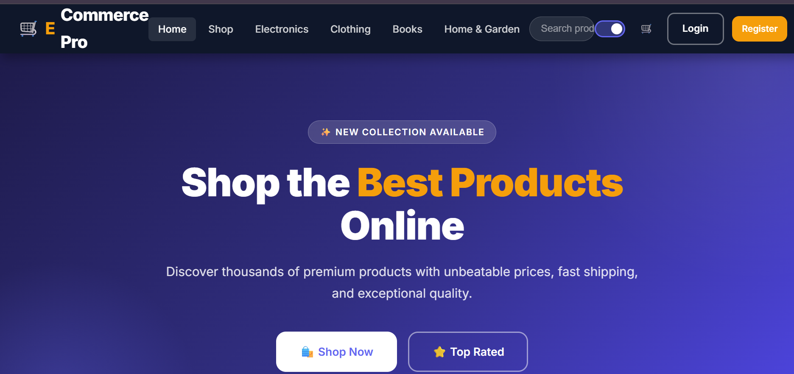
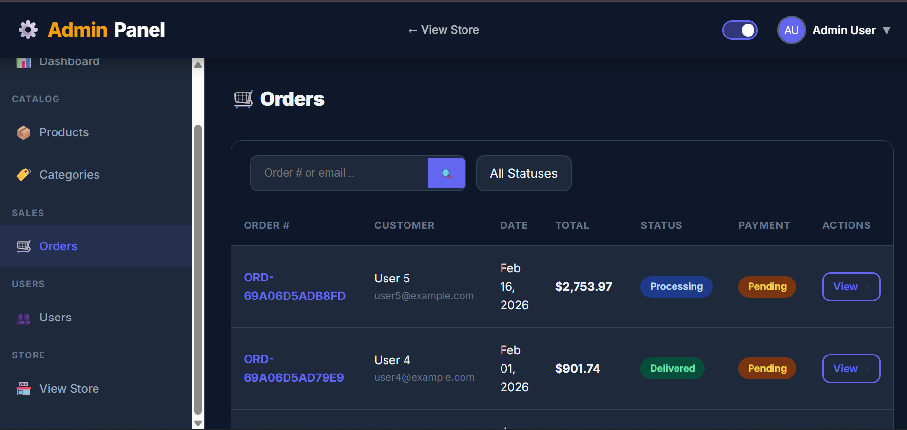
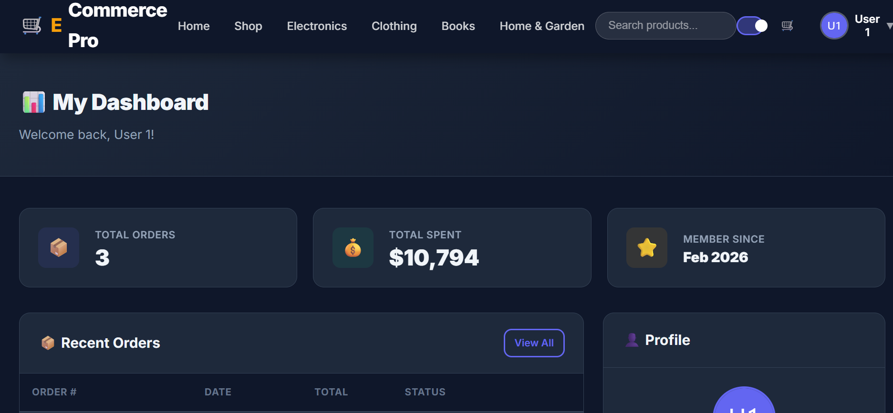

# 🛒 E-Commerce Pro

<div align="center">


A full-stack, production-ready e-commerce platform built with **Laravel 10** and **Pure CSS** — no frameworks like Bootstrap or Tailwind. Features a complete storefront, shopping cart, checkout, user dashboard, and full admin panel with dark mode support.


</div>

---

## 📸 Screenshots

| Storefront | Admin Panel | User Dashboard |
|---|---|---|
|  |  |  |
---

## ✨ Features

### 🧑‍💻 Public Storefront
- Homepage with featured products and categories
- Product listing with search, category filter, and price sort
- Product detail page with image, description, stock status, and reviews
- Session-based shopping cart (add, update, remove, clear)

### 🔐 Authentication
- Register, Login, Logout
- Email verification
- Password reset via email

### 💳 Checkout & Orders
- Place orders with stock deduction
- Order confirmation page with order number
- Full order history for authenticated users

### 👤 User Dashboard
- View all personal orders and order details
- Update account settings (name, email)
- Change password securely

### ⚙️ Admin Panel
- Dashboard with stats (revenue, orders, users, products)
- Product CRUD with image upload and stock management
- Category CRUD
- Order management with status updates
- User management with admin role toggle

### 🎨 UI / UX
- 🌙 Dark mode with persistence (localStorage)
- 📱 Fully responsive for mobile, tablet, and desktop
- Pure CSS — zero CSS frameworks used
- Custom Blade layouts for storefront, admin, and auth

---

## 🛠️ Tech Stack

| Layer | Technology |
|---|---|
| Backend | Laravel 10 (PHP 8.1+) |
| Database | MySQL 5.7+ / MariaDB |
| Authentication | Laravel Breeze (custom Blade) |
| Frontend | Blade Templates + Vite |
| CSS | Pure CSS (no Bootstrap / Tailwind) |
| JavaScript | Vanilla JS |
| Image Processing | Intervention Image v2 |
| Image Storage | Laravel Storage (local / S3) |
| API Auth | Laravel Sanctum |

---

## 📋 Requirements

Before you begin, make sure you have the following installed:

- **PHP** 8.1 or higher
- **Composer** 2.x
- **Node.js** 16+ and **npm**
- **MySQL** 5.7+ or **MariaDB**
- **Git**

---

## 🚀 Installation & Setup

### 1. Clone the repository

```bash
git clone https://github.com/marouaneradi/E-Commerce-Pro.git
cd E-Commerce-Pro
```

### 2. Install PHP dependencies

```bash
composer install
```

### 3. Install Node.js dependencies

```bash
npm install
```

### 4. Create your environment file

```bash
cp .env.example .env
```

### 5. Generate the application key

> ⚠️ This step is **mandatory**. Without it you will get **419 Page Expired** errors on every form.

```bash
php artisan key:generate
```

### 6. Configure your database

Open `.env` and update the database section:

```env
DB_CONNECTION=mysql
DB_HOST=127.0.0.1
DB_PORT=3306
DB_DATABASE=ecommerce_pro
DB_USERNAME=root
DB_PASSWORD=your_password
```

Then create the database in MySQL:

```sql
CREATE DATABASE ecommerce_pro CHARACTER SET utf8mb4 COLLATE utf8mb4_unicode_ci;
```

### 7. Run migrations and seed demo data

```bash
php artisan migrate --seed
```

This will create all tables and populate them with demo products, categories, orders, and users.

### 8. Create the storage symlink

```bash
php artisan storage:link
```

This links `storage/app/public` to `public/storage` so uploaded product images are publicly accessible.

### 9. Build frontend assets

For development (with hot reload):
```bash
npm run dev
```

For production:
```bash
npm run build
```

### 10. Start the development server

```bash
php artisan serve
```

Open your browser at **http://127.0.0.1:8000** 🎉

---

## 🔑 Demo Accounts

After running `php artisan migrate --seed`, use these credentials:

| Role | Email | Password |
|------|-------|----------|
| 👑 Admin | admin@example.com | password |
| 👤 User | user1@example.com | password |

> The admin account has full access to `/admin` panel. Regular users can browse, shop, and manage their orders.

---

## 📁 Project Structure

```
E-Commerce-Pro/
├── app/
│   ├── Http/
│   │   ├── Controllers/
│   │   │   ├── Admin/                  # Admin panel controllers
│   │   │   │   ├── DashboardController.php
│   │   │   │   ├── ProductController.php
│   │   │   │   ├── CategoryController.php
│   │   │   │   ├── OrderController.php
│   │   │   │   └── UserController.php
│   │   │   ├── Auth/                   # Auth controllers (Breeze)
│   │   │   ├── HomeController.php      # Storefront homepage
│   │   │   ├── ProductController.php   # Public product pages
│   │   │   ├── CartController.php      # Cart management
│   │   │   ├── CheckoutController.php  # Checkout & orders
│   │   │   └── UserDashboardController.php
│   │   ├── Middleware/
│   │   │   └── AdminMiddleware.php     # Protects /admin routes
│   │   └── Requests/                   # Form validation
│   ├── Models/
│   │   ├── User.php
│   │   ├── Category.php
│   │   ├── Product.php
│   │   ├── ProductReview.php
│   │   ├── Order.php
│   │   └── OrderItem.php
│   ├── Policies/                       # Authorization policies
│   └── Services/
│       └── CartService.php             # Cart business logic
├── config/                             # All Laravel config files
├── database/
│   ├── migrations/                     # Database schema
│   ├── factories/                      # Model factories for seeding
│   └── seeders/
│       └── DatabaseSeeder.php          # Demo data seeder
├── public/
│   └── images/                         # Public static images
├── resources/
│   ├── css/
│   │   ├── app.css                     # Main storefront styles
│   │   └── admin.css                   # Admin panel styles
│   ├── js/
│   │   └── app.js                      # Dark mode, cart interactions
│   └── views/
│       ├── layouts/
│       │   ├── app.blade.php           # Main storefront layout
│       │   ├── admin.blade.php         # Admin layout
│       │   └── auth.blade.php          # Auth pages layout
│       ├── admin/                      # Admin panel views
│       ├── auth/                       # Login, register, etc.
│       ├── cart/                       # Cart page
│       ├── checkout/                   # Checkout & confirmation
│       ├── partials/                   # Reusable components
│       ├── products/                   # Product list & detail
│       ├── user/                       # User dashboard
│       └── home.blade.php
├── routes/
│   ├── web.php                         # All web routes
│   └── auth.php                        # Auth routes (Breeze)
├── storage/
│   └── app/public/products/            # Uploaded product images
└── vite.config.js
```

---

## 🌐 Routes Overview

| Method | URI | Description | Auth |
|--------|-----|-------------|------|
| GET | `/` | Homepage | Public |
| GET | `/products` | Product listing | Public |
| GET | `/products/{slug}` | Product detail | Public |
| POST | `/products/{id}/review` | Submit review | Auth |
| GET | `/cart` | View cart | Public |
| POST | `/cart/add` | Add to cart | Public |
| DELETE | `/cart/remove/{id}` | Remove from cart | Public |
| GET | `/checkout` | Checkout page | Auth |
| POST | `/checkout` | Place order | Auth |
| GET | `/checkout/confirmation/{number}` | Order confirmation | Auth |
| GET | `/dashboard` | User dashboard | Auth + Verified |
| GET | `/dashboard/orders` | Order history | Auth |
| GET | `/admin` | Admin dashboard | Auth + Admin |
| GET | `/admin/products` | Manage products | Auth + Admin |
| GET | `/admin/categories` | Manage categories | Auth + Admin |
| GET | `/admin/orders` | Manage orders | Auth + Admin |
| GET | `/admin/users` | Manage users | Auth + Admin |

---

## ⚙️ Environment Variables Reference

```env
# Application
APP_NAME="E-Commerce Pro"
APP_ENV=local                   # Change to 'production' for deployment
APP_KEY=                        # Auto-generated with php artisan key:generate
APP_DEBUG=true                  # Set to false in production
APP_URL=http://127.0.0.1:8000

# Database
DB_CONNECTION=mysql
DB_HOST=127.0.0.1
DB_PORT=3306
DB_DATABASE=ecommerce_pro
DB_USERNAME=root
DB_PASSWORD=

# Session & Cache (use 'redis' in production)
SESSION_DRIVER=file
CACHE_DRIVER=file
QUEUE_CONNECTION=sync

# Storage (use 's3' for cloud storage)
FILESYSTEM_DISK=local

# Mail (configure SMTP for email verification / password reset)
MAIL_MAILER=smtp
MAIL_HOST=smtp.gmail.com
MAIL_PORT=587
MAIL_USERNAME=your@gmail.com
MAIL_PASSWORD=your_app_password
MAIL_ENCRYPTION=tls
MAIL_FROM_ADDRESS="hello@ecommerce-pro.com"
```

---

## 🏭 Production Deployment

### Optimize for production

```bash
composer install --no-dev --optimize-autoloader
npm run build
php artisan config:cache
php artisan route:cache
php artisan view:cache
php artisan optimize
```

### Environment settings for production

```env
APP_ENV=production
APP_DEBUG=false
SESSION_DRIVER=redis
CACHE_DRIVER=redis
QUEUE_CONNECTION=redis
FILESYSTEM_DISK=s3
```

### Deploying on Render (Docker)

The project includes a `Dockerfile` and `docker/` folder ready for deployment.

1. Push the repo to GitHub
2. Go to [render.com](https://render.com) → **New Web Service**
3. Connect your GitHub repository
4. Set **Environment** to Docker
5. Add these environment variables in the Render dashboard:

```
APP_KEY=<run: php artisan key:generate --show>
APP_ENV=production
APP_DEBUG=false
DB_CONNECTION=mysql
DB_HOST=<your-mysql-host>
DB_DATABASE=ecommerce_pro
DB_USERNAME=<username>
DB_PASSWORD=<password>
```

6. Create a MySQL database on Render (or use [PlanetScale](https://planetscale.com) free tier)
7. Click **Deploy**

---

## 🐛 Common Issues & Fixes

### ❌ 419 Page Expired
Your `APP_KEY` is missing or empty in `.env`.
```bash
php artisan key:generate
```

### ❌ Method `handleRequest` does not exist
Your `public/index.php` uses Laravel 11 syntax but this project runs on Laravel 10. Replace line 17 with:
```php
$kernel = $app->make(Illuminate\Contracts\Http\Kernel::class);
$response = $kernel->handle($request = Illuminate\Http\Request::capture());
$response->send();
$kernel->terminate($request, $response);
```

### ❌ `Argument #2 ($paths) must be of type array, null given`
`config/view.php` is missing. Create it with:
```php
<?php
return [
    'paths' => [resource_path('views')],
    'compiled' => realpath(storage_path('framework/views')),
];
```

### ❌ Images not showing after upload
```bash
php artisan storage:link
```

### ❌ Class not found / autoload errors
```bash
composer dump-autoload
php artisan clear-compiled
```

### ❌ Views are cached / showing old content
```bash
php artisan view:clear
php artisan cache:clear
php artisan config:clear
```

---

## 🤝 Contributing

Contributions are welcome! To contribute:

1. Fork the repository
2. Create a feature branch: `git checkout -b feature/your-feature-name`
3. Commit your changes: `git commit -m 'Add: your feature description'`
4. Push to the branch: `git push origin feature/your-feature-name`
5. Open a Pull Request on GitHub

---

## 📄 License

This project is open source and available under the [MIT License](LICENSE).

---

## 👤 Author

**Marouane Radi**

- GitHub: [@marouaneradi](https://github.com/marouaneradi)
- Repository: [E-Commerce-Pro](https://github.com/marouaneradi/E-Commerce-Pro)

---

<div align="center">
  Made with ❤️ using Laravel
</div>
